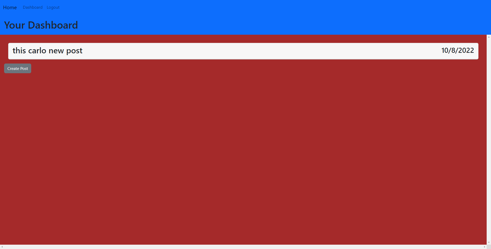

# Tech Blog

## Description

This applicate demonstrates a full stack blog site. The back end consists of express (and other packages that connect to express), sequelize, bcrypt, handlebars, and dotenv to keep environment variables hidden. The front end is put together with html (html created and rendered by handlebars on the back end), js, and makes use of bootstrap.

The screenshot below shows the landing page that a user would see whether they are logged in or not. 

The screenshot below displays the login page that the user is sen tto if they try to access other parts of the site like the dashboard or viewing a specific post without being logged in.

The screenshot below is what is shown when you click on a blog post while signed in.

The screenshot below displays the dashboard with posts the logged in user has made

The screenshot below displays the update/delete page for a specific post the logged in user has made

## Deployed Site

[Heroku Link](https://polar-falls-86410.herokuapp.com/)

## Technologies Used

- [Visual Studio Code](https://code.visualstudio.com/)
- [Github](https://github.com/)
- [Node JS](https://nodejs.org/dist/latest-v16.x/docs/api/)
- [Insomnia Core](https://insomnia.rest/products/insomnia)
- [Bootstrap](https://getbootstrap.com/docs/5.2/getting-started/introduction/)
- [bcrypt](https://www.npmjs.com/package/bcrypt)
- [connect-session-sequelize](https://www.npmjs.com/package/connect-session-sequelize)
- [dotenv](https://www.npmjs.com/package/dotenv)
- [express](https://www.npmjs.com/package/express)
- [express-handlebars](https://www.npmjs.com/package/express-handlebars)
- [express-session](https://www.npmjs.com/package/express-session)
- [mysql2](https://www.npmjs.com/package/mysql2)
- [sequelize](https://www.npmjs.com/package/sequelize)
